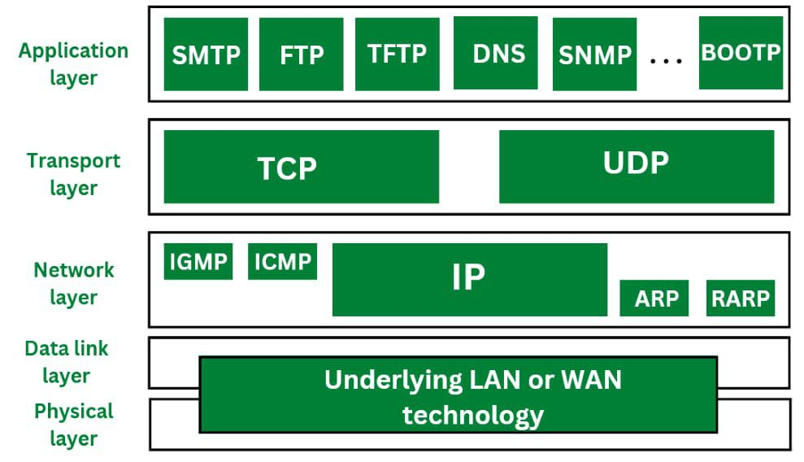

# ArborFlow: Python Network Attack Simulator

ArborFlow is a network security simulation tool built in **Python**. It allows you to simulate network traffic and test firewall filtering logic by processing large datasets of synthetic packets.

## 🚀 Key Features
- **Attack Simulation**: Process thousands of packets from `packets.csv` to see how a firewall reacts.
- **Instant Filtering**: High-speed IP lookup using Python's efficient hashing sets.
- **Customizable Traffic**: Use the provided scripts to generate custom packet datasets.
- **Detailed Analytics**: Get a full report on dropped vs. passed traffic.

---

## Understanding Network Packets

Network packets are the fundamental units of data transmitted across a network, structured with multiple layers of encapsulation. Each packet consists of a payload (the actual data) wrapped in headers from **Layer 2 (Ethernet)**, **Layer 3 (IP)**, and **Layer 4 (TCP/UDP)**, which provide essential routing and protocol information. ArborFlow intercepts these packets and peels them back layer-by-layer—a process called decapsulation—to extract metadata like source IPs and port numbers for filtering and scheduling.



In the C environment, these packets are processed as raw streams of `u_char` bytes, representing 8-bit chunks of binary memory. The engine interprets this data by overlaying C structures as "stencils" that map the binary stream to specific header fields. This high-speed ingestion is managed by **libpcap**, which sniffs live traffic directly from the network interface. By utilizing kernel-level Berkeley Packet Filters (BPF), libpcap discards irrelevant traffic before it reaches the application, ensuring the engine maintains the throughput necessary for real-time security processing.

---

## Core Concepts Used

| Module | Concept |
| :--- | :--- |
| **Capture Engine** | Networking (libpcap), OS |
| **Queue** | Lock-Free Concurrent Queue |
| **Gatekeeper** | 4-Level IpTrie with BitVector Leafs |
| **Scheduler** | Max Heap (Priority Queue) |
| **Session Manager** | Splay Tree (5-tuple keyed) |

---

## Architecture Flow

```text
Internet Traffic
       ↓
[ Capture Engine (libpcap) ]
       ↓
[ Packet Parsing (IP/TCP/UDP) ]
       ↓
[ Concurrent Queue (Lock-Free) ]
       ↓
[ Gatekeeper (Firewall Logic) ]
       ↓
[ Session Manager (Splay Tree Tracking) ]
       ↓
[ Scheduler (Max Heap Priority Queue) ]
       ↓
[ Process / Output ]
```

---

## Project Structure

```text
ArborFlow/
└── core_engine/
    ├── Makefile
    ├── main.c
    ├── include/
    │   ├── capture.h
    │   ├── concurrent_q.h
    │   ├── bit_vector.h
    │   ├── ip_trie.h
    │   ├── splay_tree.h
    │   └── gatekeeper.h
    ├── src/
    │   ├── capture.c
    │   ├── concurrent_q.c
    │   ├── bit_vector.c
    │   ├── ip_trie.c
    │   ├── splay_tree.c
    │   └── gatekeeper.c
    ├── scheduler/
    │   ├── packet.h
    │   ├── scheduler.h
    │   └── scheduler.c
    └── tests/
        ├── test_gatekeeper.c
        └── capture_demo.c
```

---

## Features

* **Real-time packet capture:** Utilizes `libpcap` for live interface sniffing.
* **Fast filtering:** IpTrie implementation provides $O(1)$ exact lookup over the IPv4 address space.
* **Self-adjusting tracking:** Splay Tree provides amortized $O(1)$ access for active network sessions.
* **High throughput:** Employs a lock-free concurrent queue to bridge capture and processing threads.
* **Priority scheduling:** Max Heap ensures critical packets (e.g., DNS, Web) are handled first.

---

## How It Works

### 1. Capture Engine
Extracts Source IP, Destination IP, Protocol, and Packet size from the raw network interface using `libpcap`.

### 2. Priority Assignment
Assigns numeric priorities based on protocol and port:
* **TCP (80/443):** Priority 8 (High)
* **UDP (53):** Priority 9 (Very High)
* **Others:** Priority 5 (Normal)

### 3. Gatekeeper (Firewall)
The gatekeeper uses a four-level radix trie over the 32-bit IPv4 address space. Each IP is decomposed into four bytes, descending through pointer levels to a BitVector leaf. Lookup traverses exactly four pointer dereferences plus one bit read—O(1) with a small constant.

### 4. Session Manager (Splay Tree)
Tracks active flows using a 5-tuple key. The splay tree moves the most recently accessed sessions to the root, optimizing performance for dominant flows (e.g., streaming or file transfers) to amortized $O(1)$.

### 5. Scheduler (Heap)
The Max Heap acts as the final arbiter, reordering the passed packets so that the highest priority traffic is processed before lower-priority data.

---

## Running the Project

### Step 1: Navigate
`cd ArborFlow/core_engine`

### Step 2: Build
`make clean && make`

### Step 3: Run
`sudo ./arborflow eth0`

---

## Why Linux / WSL is Required

This project relies on native Linux networking headers and libraries:
* `libpcap`: Native Linux networking library.
* System headers: `netinet/ip.h`, `unistd.h`, and `pthread.h`.
* Direct hardware access for promiscuous mode.

---

## Sample Output

```text
[PROCESS] 91.189.91.83 -> 172.19.231.46 Priority:5 Size:1494
[PROCESS] 172.19.231.46 -> 91.189.91.83 Priority:8 Size:86
```

---

## Team Contribution

* **Capture Engine:** Networking and Threading
* **Gatekeeper:** Advanced Trees and Bit Vectors
* **Scheduler:** Heap (Priority Queue) Implementation
* **Queue:** Concurrent Data Structures
* **ML/Visualization:** Python integration (optional extension)

---

## Conclusion

ArborFlow demonstrates how advanced data structures and systems programming can be combined to build a real-world, high-performance network engine.